# Assignment4
Yusu Weng(yw706) Zhaoxiang Liu(zl355)

## CNN-Regression Approach
### Model Structure
Input Layer

$\Downarrow$

Convolutional Layer

$\Downarrow$

Convolutional Layer

$\Downarrow$

MaxPooling Layer

$\Downarrow$

Flatten Layer

$\Downarrow$

Dropout Layer

$\Downarrow$

FullConnected Layer

$\Downarrow$

FullConnected Layer

$\Downarrow$

Output Layer
### Representing the process
To better solve the problem, we first convert RGB color space to CIELAB(LAB) color space. The LAB space consists of three channels: L for lightness, A for green-red, B for blue-yellow. The value of L ranges from 0 to 100, while other two channel range from -128 to 127. Since the grayscale image only has L channel, we can represent the process as mapping the L channel as input to the A&B channels as the output. At last, we convert the predicted LAB space back to the RGB space.

### Data

We obtain the data from Imagenet, with the category of seashore.
```
http://image-net.org/api/text/imagenet.synset.geturls?wnid=n09428293
```
Due to the limitation of the computing power of our laptops, we only downloaded 1000 images as the train set, and 100 addtional images as the validation set.

These images are not included in the archive but can be downloaded by the python script `get_dataset.py`

### Preprocess
Before training, we resize the images to 64pixelsx64pixels and read as a 2D array.

We also preprocess the input values of LAB channels, converting them range from 0 to 1.
### Evaluation

We choose Mean-squared Error(MSE) as the loss function:

$Loss=\frac{1}{n}\sum^{n}_{i=1}{\sqrt{(\tilde{A_i}-A_i)^2+(\tilde{B_i}-B_i)^2}}$

n is the total number of pixels

We also define that if $|\tilde{A_i}-A_i|\leq=10$ and $|\tilde{B_i}-B_i|\leq=10,pixel_i$ is correct since human can hardly tell the difference.

So the $accuracy=\frac{\#\{correct pixels\}}{\#\{total pixels\}}$

### Training

Instead of Gradient descent, we choose Stochatic gradient descent for two reasons. First, it is computationally cheaper to compute the gradients with respect to one of these loss terms
rather than every loss term in the full sum of dataset. Second, SGD is less likely to be trapped in local minima as it is less sensitive to fine grained details in dataset. Practically, we set the batch size as 10 instead of the total number of the dataset.


We also introduce some methods to prevent overfitting:

`Regularization`

We add a L2 Regularizer to the loss function:

$Cost=Loss+\lambda\sum{||w||^2}$

In practice we set the $\lambda$ 0.001

`Early Termination`

As mentioned before we have a validation set to track the performation. We can terminate the training when the error on the validation set beigin to increase.

`Dropout Layer`

The dropout layer can ignore certain sets of neurons during the training which is chosen at random.Dropout forces a neural network to learn more robust features that are useful in conjunction with many different random subsets of the other neurons.We set the dropout rate as 0.2

### Assessment
Our model can reach a 68% accuracy on coloring images with category of seashore. 

`Demos`

`Example1`

Real

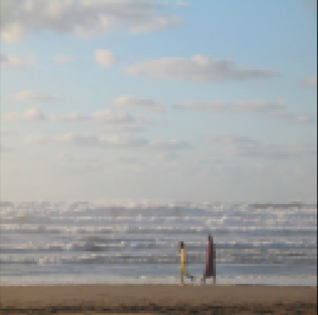

Prediction

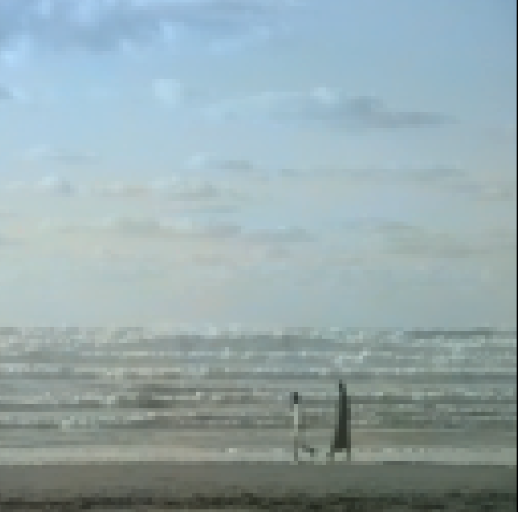

`Example2`

Real

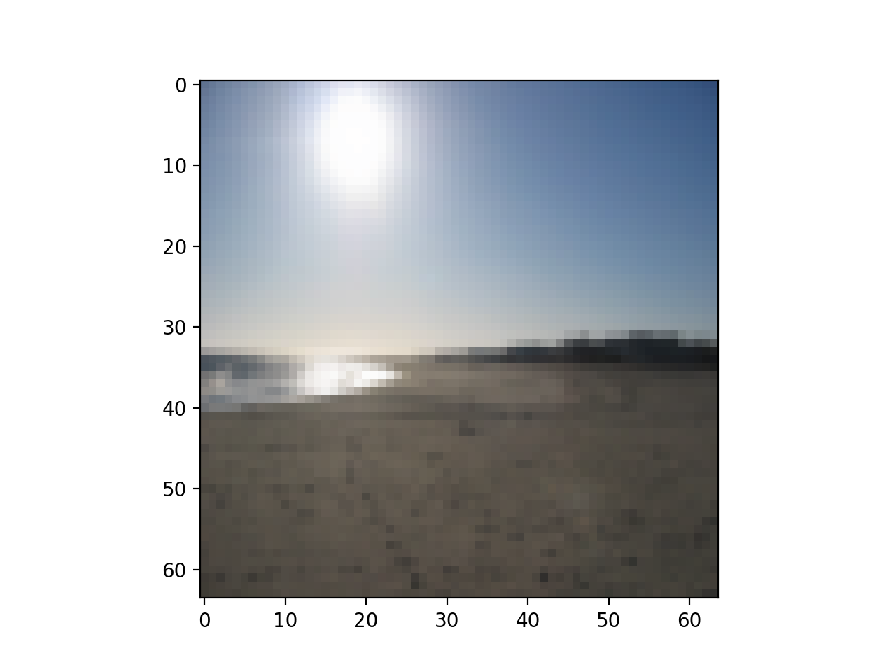

Prediction

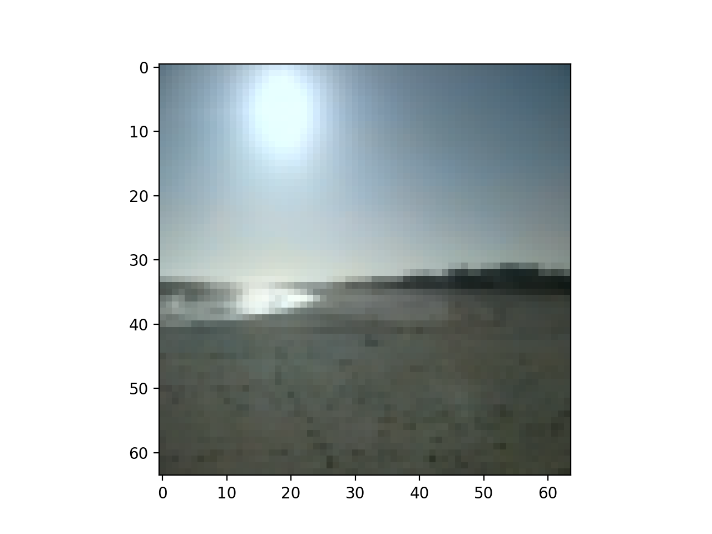

`Example3`

Real

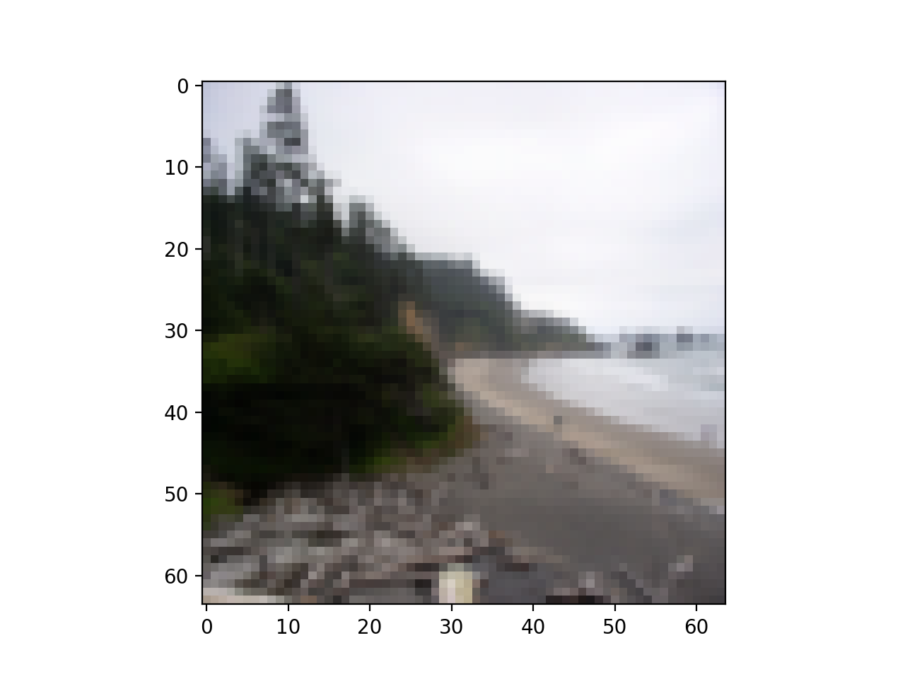

Prediction

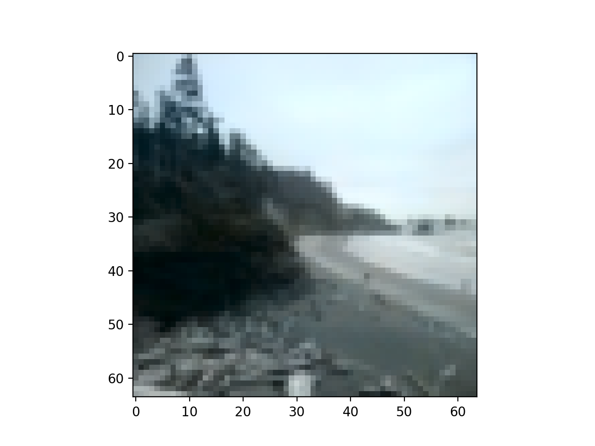

`Example4`

Real
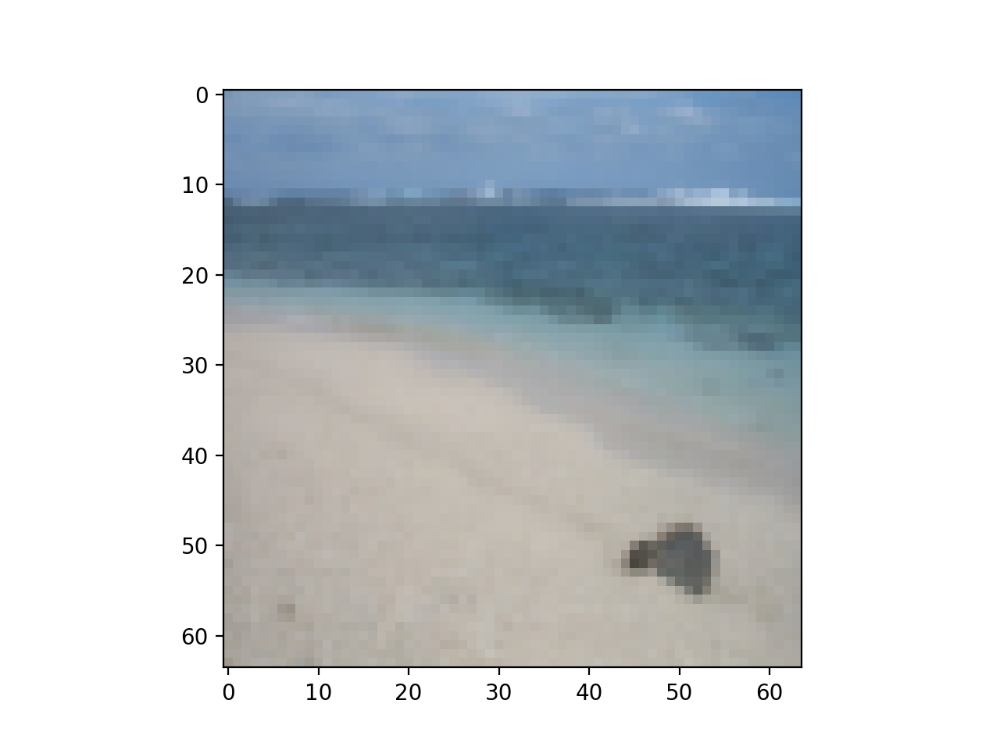

Prediction

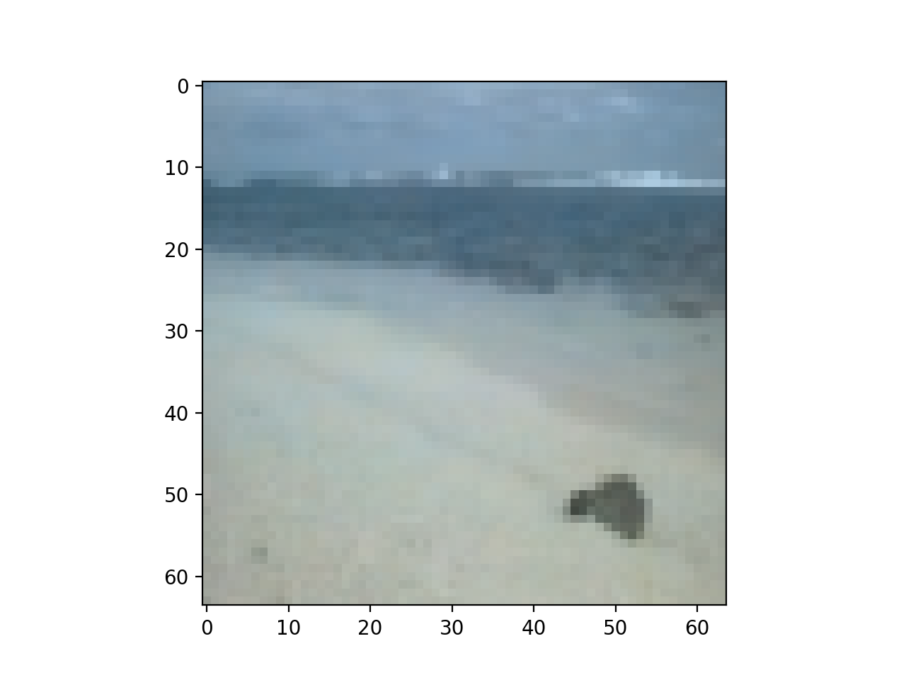

Base on our observation, predicted images make sense in some degree, but still have some evident flaws:

First, the overall prediction of our model is conservative. The predicted color is always less vivid than the real color.

Second, the margin between sea, sky and beach is vague and the model tend to use close colors to colorize them.

Finally, the model may confuse the sea with beach if the coastline is irregular.

Besides, the model cannot handle the images that are not seashore at all as was expected. The model will try to use blue and yellow which are colors of sea and sands to colorize the image.

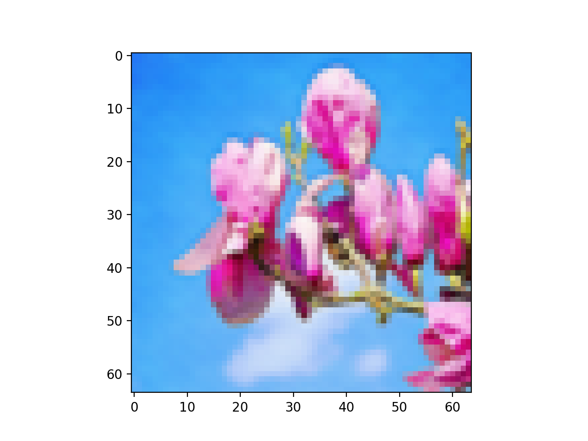

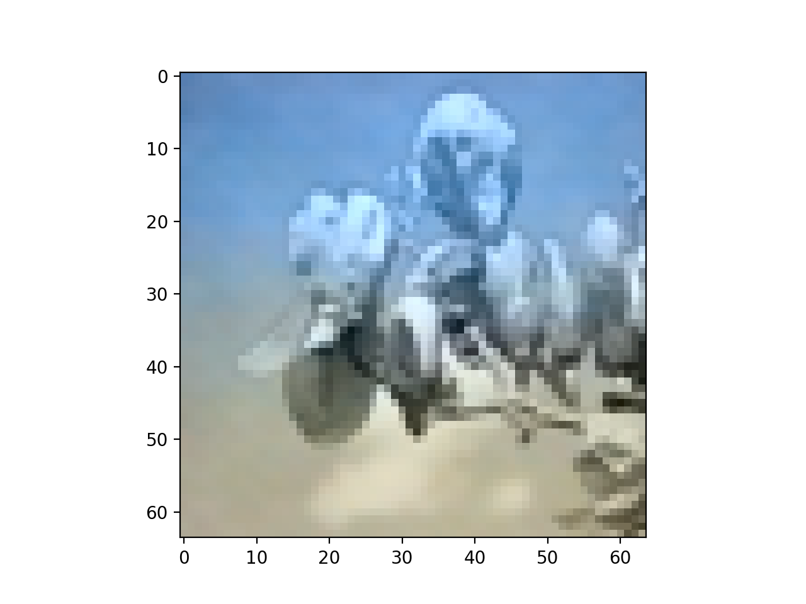
### Rethinking & Improvement

First, the size of dataset maybe not enough for the problem as our model seems not to extract all the features from the image correctly, which leads some mistakes when finding the margin between land and sea.

Then, the loss function we choose encourages the model to make a conservative selection on colors. These losses are inherited from standard regression
problems, where the goal is to minimize Mean squared error between an estimate
and the ground truth.
Additionally, the model will prefer to use a set of similar color uniformly rather than choose a set of colors that are distinct to each other.

To improve it, maybe we should try to consider it as a classification problem rather than a regression problem to avoid the model to choose an mean of the set. Instead, we can use cross entropy loss to have a better performance

## Simple NeuralNetwork-Classificaton Approach

### Model Structure

9 neurons => 9 neurons=>4 neurons(one-hot code)

### Representing the process

We apply a simple neural network as our classification method. For each input image with RGB color space, We know that each value ranges from 0 to 255. It's difficult for us to apply the classification method because we may need to set up a 255 one-hot code output layer, the calculation cost is too high so we firstly normalize our RGB values only have 4 options[0,80,160,240]. So our hot-code only needs to be set up with 4 neurons with a combination of 1 and 0 to represent each RGB value separately. For each gray pixel value, we will predict the R, G, B value separately and combine them finally as an output image. We will explain our network detail below
For a simple neural network, we have a [9,9,4] layer structure. 9 neurons as input layer and 4 neurons as output layer. Our neural network model simply aims to map a single gray color value to an R, G, B color value separately. Firstly we will input an image and set a  sliding window. Second, we will extract each pixel from the entire picture from the top left corner to the bottom right corner. Each step we will choose the selected pixel and its surrounding 8 pixels as input, so we have enough information to avoid bias and reconstruct the correct color. The training output is a one-hot code which represents R or G or B value
We will build 3 neural networks for training R, G and B color value simultaneously. and reconstruct the image using RGB color space

### Data

We use the same dataset but because our neural network is simple and train for each pixel. We use similar photos of the scene to make the dataset in order to get a high recover result

### Preprocess

For simple neural network we don't do too much pre-processing job. Just train 3 models for each pixels input and predict the R,G and B value. 

Once we get the predicted value from 2 method we wil reconstruct the image using RGB color space and Matlab built-in library

### Evaluation

Because we have already normalized the RGB color space to one of the value of [0,80,160,240]

So for the input and output RGB image nparray we firstly divide by 80 and use Euclidean distance to measure the difference:


Second because each picture we predicted has a different scale so we will calculate the mean of Euclidean distance for each image and result will be comparable and generic

Error=Total Euclidean distance /numbers of pixels

We prove our error metric is correct and consistent with our percetual error in assessment part

### Training

For deatail training process we mentioned in the 1st part 

We use tanh as our activation function because it's more advanced in simple neural network structure and also use the number of epochs and learning rate to control the training process and to find a convergence. For our model we set epochs=20000 and learning rate=0.05 with gradient descent. I think it is enough to reach a high complete neural network

### Assessment and improvement

We use Mean Euclidean distance as our Error to measure the result.

For sky error: 0.00043409591371904786

For forest error: 0.0009118240178506841

For scenery error:0.0019461416507325722

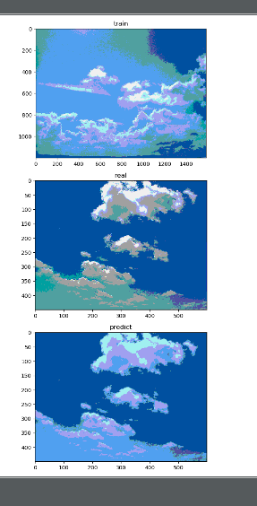


Error: 0.00043409591371904786

From the pictures, we can observe that the model can distinguish sky and cloud. Because our training data is simple so the recover result perform well

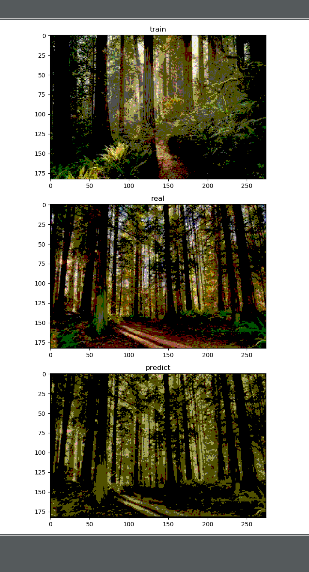

Error: 0.0009118240178506841

The above test shows that a slight distortion appears for the recovered image, We can still recognize the feature of a forest but with wrong color space. Because environmental complexity has increased. The Mean Euclidean distance is also bigger than the previous one, which also proves that numerical/quantified error and perceptual error perform consistently

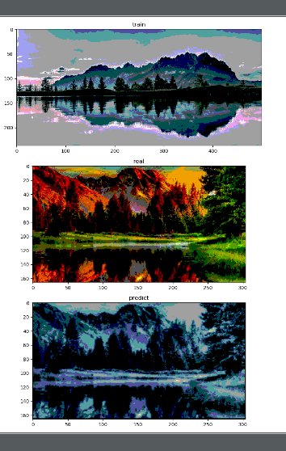

Error: 0.0019461416507325722

From the above experiment we can conclude even if our training data and test data have the same structure but different color space we still cannot avoid coloring wrong. We train our model to fit the B color space even if our input picture has the same structure will still get a blue-like picture with big distortion

Our program is good at the same color space coloring and the picture with small complexity

I think the result still can be improved. If we increase the sorts of colors used in classification, we maybe able to improve the result and avoid the distortion, (A longer one-hot code can not only increase the color space but also improve fault tolerance for different color space picture). 
Also, we can enlarge our dataset to get a better result.


